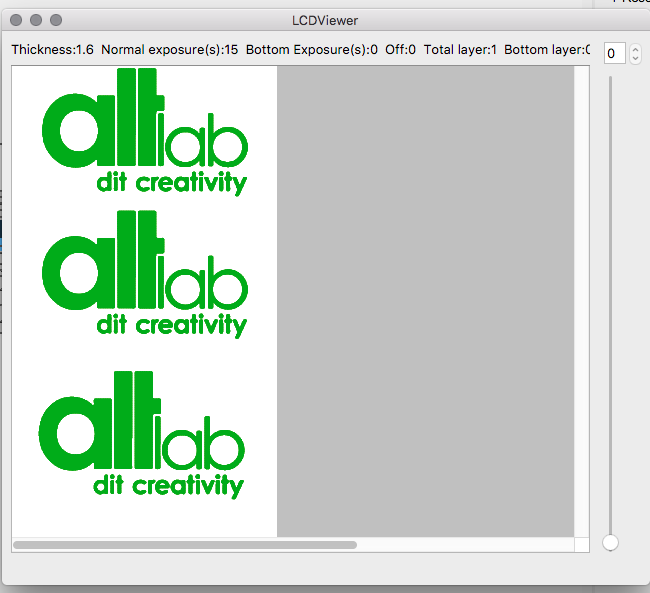

#  PCB to Photon

## Overview
**This is a tool to convert PCB images (still to be determined full scope) into the .photon file format. This is the file format used by the Anycubic's 3D UV Photon DLP 3D printer. The goal is to leverage the printer UV capabilites into PCB UV masking.**

## Description
Photon files are currently monochromatic files with a 1440x2560 image size.

## Name
pcb2photon - Image to photon UV PCB mask converter

## Synopsis
pcb2photon [-h] [-t threshold-value] [-a alignment-options] [-s image-scaling] [-p thickness] [-e exposure-time] filename [filename2 [...]] [-o output_filename [output_filename2 [...]]]

## Options
Command parameters:

*filename*    is a supported image filename

* -t [threshold-value]       Threshold that defines the value cap for non-monocromatic images.
* -a [alignment-options]      Image alignment options within the .photon image size.
    * c       Centering on screen;
    * ul      Upper left corner;
    * ll      Lower left corner;
    * ur      Upper right corner;
    * lr      Lower right corner;
    * cl    Center left side;
    * cr    Center right side;
    * cu    Center upper side;
    * cl    Center lower side.
* -s [image-scaling]       Defines the image stretching options.
    * o       original scale;
    * v       vertical fit;
    * h       horizontal fit;
    * f       stretch to fit;
    * n [__value__]       scale by a factor of __value__ .
* -p [thickness]        PCB thickness value in mm (needed to lift the print bed)
* -e  [exposure-time]     Exposure time in seconds
* -o [output_filename [output_filename2 [...]] Specify output file names, if no name are provided the input file name will be used.
* -h Displays this information

## Result of one of the included test images

